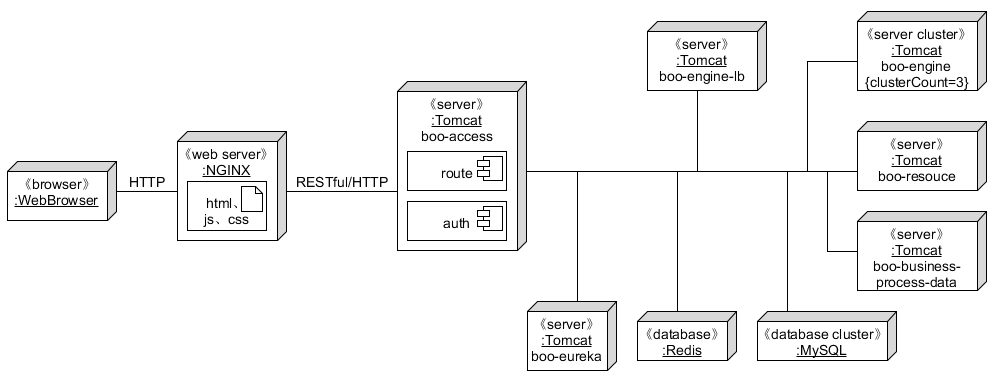

# BooWFMS

## 项目介绍

面向业务对象的多租户云业务流程管理系统。

## 项目架构

### 整体架构图

### 模块介绍

| Name                      | Features                                                     |
| ------------------------- | ------------------------------------------------------------ |
| boo-eureka-server         | [服务注册中心](https://cloud.spring.io/spring-cloud-netflix/2.2.x/reference/html/#spring-cloud-eureka-server) |
| boo-engine                | [面向业务对象的业务流程解析执行引擎](https://sysuworkflower.github.io/BOOWorkflow/) |
| boo-resource              | 负责给工作项分配资源（人力资源或计算资源）                   |
| boo-access                | [鉴权与网关](https://cloud.spring.io/spring-cloud-netflix/2.2.x/reference/html/#router-and-filter-zuul) |
| boo-engine-lb             | 解析执行引擎负载均衡器                                       |
| boo-business-process-data | 业务流程相关数据读写                                         |
| boo-common                | 项目基础包                                         |
| boo-activiti-engine       | 无状态工作流引擎Activiti                                     |
| boo-activiti-process-execution       | 无状态云工作流系统准入和调度模块                                     |

 监控grafana:http://222.200.180.59:3000/d/8ZoWy2T7z/engine-dashboard?orgId=1&refresh=5s
 账密:admin
 
 docker-compose部署文件: workflow1中：/home/stack/wuyunzhi/docker-compose.yml
 该部署限额 activiti-engine能承受的负载量为每秒50 即gatling脚本中user上限为50/4
 
 ## gatling脚本
 使用的流程定义为online-shopping-two-task，含两个任务
 
 ### 不做缓冲处理（user数量过大会冲爆engine）
 /home/stack/wuyunzhi/gatling-charts-highcharts-bundle-3.6.1/user-files/simulations/computerdatabase/startAndComplete.scala
 ### FIFO+阈值限制
 /home/stack/wuyunzhi/gatling-charts-highcharts-bundle-3.6.1/user-files/simulations/computerdatabase/startAndCompleteFIFO.scala
 ### 准入控制+阈值限制
 /home/stack/wuyunzhi/gatling-charts-highcharts-bundle-3.6.1/user-files/simulations/computerdatabase/startAndCompleteWithDelay.scala
 
 
 boo-activiti-process-execution http://222.200.180.59:10238/activiti-process-execution
 boo-activiti-engine-query-start http://222.200.180.59:10239/activiti-engine-query-start